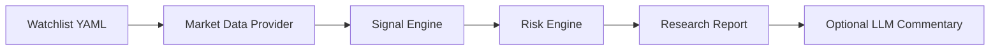

# Architecture

Trade Sentinel is built around a simple agent pipeline:

## Components

### Data Provider

`trade_sentinel.data` fetches recent price data. In normal mode it uses `yfinance`; in offline mode it generates deterministic sample data so tests and demos do not need network access.

### Signal Engine

`trade_sentinel.strategy` combines:

- Trend position versus moving averages
- Recent price momentum
- Short-term volatility

The result is a bounded score from 0 to 100 and one of three labels: `bullish`, `neutral`, or `avoid`.

### Risk Engine

`trade_sentinel.risk` caps allocation using available cash, per-position limits, and volatility limits. The goal is to make every idea size-aware.

### AI Layer

`trade_sentinel.agent.optional_ai_commentary` can call an LLM when `OPENAI_API_KEY` is present. The deterministic scoring engine remains the source of truth; the model only narrates and summarizes the results.

## Design Principles

- Explainability first
- No live trading in v1
- Offline demo support
- Testable deterministic core
- Risk controls before narration
