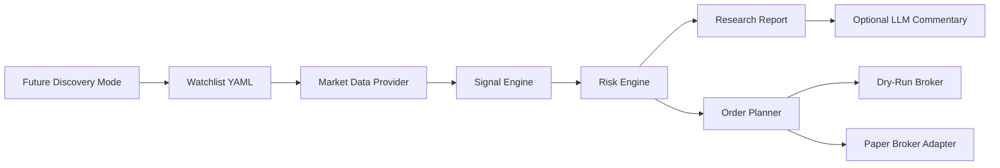

# Architecture

Trade Sentinel is built around a simple agent pipeline:

## Components

### Data Provider

`trade_sentinel.data` fetches recent price data from Yahoo Finance through `yfinance`. Free public data can be delayed and rate limited, so the provider is appropriate for research and paper trading rather than low-latency execution.

### Universe Selection

The current universe selection layer is a YAML watchlist. This is intentional: it keeps the first version explainable and prevents the agent from turning into an unbounded scanner with noisy results.

A future discovery layer can sit before the watchlist and generate candidate symbols from a larger market universe. That layer should be rule-based first, using filters such as minimum volume, minimum price, trend strength, volatility, and sector. The output of discovery should still flow into the same signal and risk engines.

### Signal Engine

`trade_sentinel.strategy` combines:

- Trend position versus moving averages
- Recent price momentum
- Short-term volatility

The result is a bounded score from 0 to 100 and one of three labels: `bullish`, `neutral`, or `avoid`.

### Risk Engine

`trade_sentinel.risk` caps allocation using available cash, per-position limits, and volatility limits. The goal is to make every idea size-aware.

### Order Planner

`trade_sentinel.trading` converts high-quality bullish signals into `OrderTicket` objects. It checks minimum score, estimated allocation, available cash, max order value, and fractional-share settings.

The planner does not submit trades by itself. It only creates structured tickets that can be printed, dry-run, or sent to a paper broker.

### Broker Layer

`trade_sentinel.broker` defines a broker interface and two execution paths:

- `DryRunBroker`: always safe; it never sends an external order.
- `AlpacaBroker`: broker-ready adapter for paper trading when API credentials are configured.

The CLI blocks live execution intentionally. Live trading should require additional account checks, kill switches, audit logs, and manual approval.

### AI Layer

`trade_sentinel.agent.optional_ai_commentary` can call an LLM when `OPENAI_API_KEY` is present. The deterministic scoring engine remains the source of truth; the model only narrates and summarizes the results.

## Design Principles

- Explainability first
- No live trading in v1
- Real market data by default
- Deterministic unit tests around the scoring engine
- Explicit universe selection before stock scoring
- Dry-run execution before broker execution
- Risk controls before narration
