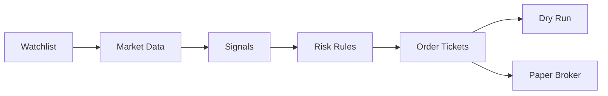

# Trading Workflow

Trade Sentinel is now structured like a real trading application, but it stays safe by default.

## Workflow



## Commands

Research only:

```bash
trade-sentinel analyze --watchlist examples/watchlist.yaml --cash 10000
```

Create order tickets:

```bash
trade-sentinel plan-trades --watchlist examples/watchlist.yaml --cash 10000
```

Dry-run execution:

```bash
trade-sentinel plan-trades --watchlist examples/watchlist.yaml --cash 10000 --execute --mode dry-run
```

Paper broker execution:

```bash
trade-sentinel plan-trades --watchlist examples/watchlist.yaml --cash 10000 --execute --mode paper
```

## Risk Controls

The order planner uses:

- `--min-trade-score`
- `--max-position-pct`
- `--max-volatility-pct`
- `--max-order-value`
- `--whole-shares`

The default behavior supports fractional shares and caps a single order at `$2,000`.

## Broker Integration

The first broker-ready adapter targets Alpaca because it supports paper trading.

Required environment variables:

```bash
ALPACA_API_KEY
ALPACA_SECRET_KEY
ALPACA_BASE_URL
```

Use the paper URL first:

```text
https://paper-api.alpaca.markets
```

## Live Trading Guard

The CLI intentionally blocks `--mode live`.

Live trading needs more protection than a first project version should silently provide. Before enabling it, add:

- Account position checks
- Existing open-order checks
- Daily loss limits
- Duplicate order prevention
- Audit logs
- Manual confirmation
- Emergency stop configuration
